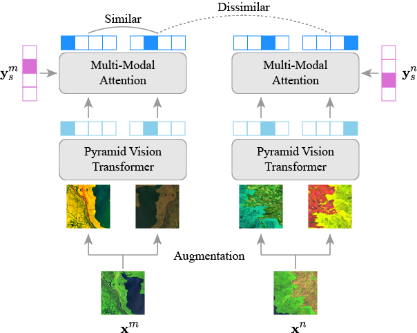

**MMST-ViT: Predicting Crop Yields with Multi-Modal Spatial-Temporal Vision Transformer for Climate Change Adaptation**

## Model Overview


This repository provides the official implementation of our proposed Multi-Modal Spatial-Temporal Vision Transformer (MMST-ViT), developed for predicting crop yields at the county level across the United States for different fips codes. It consists of a Multi-Modal Transformer, a Spatial Transformer, and a Temporal Transformer. The Multi-Modal Transformer leverages satellite images and meteorological data during the growing season to capture the direct impact of short-term weather variations on crop growth. The Spatial Transformer learns the high-resolution spatial dependency among counties for precise crop tracking. The Temporal Transformer captures the effects of long-term climate change on crops.

## Datasets

### The Tiny CropNet Dataset

This paper utilizes the ***Tiny CropNet*** dataset for accurate county-level crop yield predictions. Specifically, the Tiny CropNet dataset is composed of three modalities, i.e., Sentinel-2 Imagery, WRF-HRRR Computed Dataset, and USDA Crop Dataset,
with their details outlined below:

- **Sentinel-2 Imagery**: The dataset is a set of 384x384 RGB images captured by the Sentinel-2 Earth observation satellite. It provides agriculture imagery for the contiguous U.S. continent from 2017 to 2022 with a 2-week interval. Since precise agricultural tracking requires high-resolution remote sensing data, the image of a county is partitioned into multiple fine-grained grids (9×9 km).

- **WRF-HRRR Computed Dataset**: The dataset, obtained from the Weather Research & Forecasting-based High-Resolution Rapid Refresh Model (WRF-HRRR), provides high-resolution meteorological data for the contiguous U.S. continent. It covers 9 weather parameters from 2017 to 2022.

- **USDA Crop Dataset**: The dataset, sourced from the United States Department of Agriculture (USDA), provides annual crop data for major crops grown in the United States (U.S.), including corn, cotton, soybean, winter wheat, etc., on a county-level basis. It covers crop information such as production and yield from 2017 to 2022.

Now, the Tiny CropNet dataset is available at [HuggingFace Datasets](https://huggingface.co/datasets/fudong03/Tiny-CropNet/tree/main).


## Requirements

Our model is based on the following libraries:

- torch == 1.13.0
- torchvision == 0.14.0
- timm == 0.5.4
- numpy == 1.24.4
- pandas == 2.0.3
- h5py == 3.9.0
- einops == 0.6.1
- Pillow == 10.0.0
- argparse == 1.4.0
- tqdm == 4.65.0
- scikit-learn == 1.3.0
- tensorboard == 2.13.0

You can use the following instructions to install all the requirements:

```python
# install requirements
pip install -r requirements.txt
```
the requirement may not support the version of the Pycharm , so based on what version of pycharm or other tools the user have, the user have to update the requirements accordingly.
The following code shows how to generate the JSON configuration file for the data loader.
```python
python config/build_config_cropname.py
```
cropname:soybean,corn,winterwheat,cotton.

## Pre-training




The above figure illustrates the architecture of our proposed multi-modal self-supervised pre-training.

To pre-train the MMST-ViT model, the command varies slightly depending on the operating system due to platform-specific differences in resource management and compatibility. For Windows, the standard command `python main_pretrain_mmst_vit.py` can be used without modification. However, on macOS, it is recommended to specify the device (`--device cpu`) and the number of workers (`--num_workers 0`) explicitly to ensure compatibility and prevent potential issues with multiprocessing, which behaves differently on macOS compared to Windows. The modified command for macOS is: `python main_pretrain_mmst_vit.py --device cpu --num_workers 0`. This adjustment ensures smooth execution of the script and aligns with the system's capabilities for handling computational tasks.


## Fine-tuning

To fine-tune the MMST-ViT model for crop yield predictions, the command may need to be adjusted based on the operating system to ensure compatibility. On Windows, the standard command `python main_finetune_mmst_vit.py` works without requiring modifications. However, for macOS users, it is recommended to specify the device (`--device cpu`) and the number of workers (`--num_workers 0`) to address differences in how multiprocessing is handled on macOS. The adjusted command for macOS is: `python main_finetune_mmst_vit.py --device cpu --num_workers 0`. This ensures that the fine-tuning process runs smoothly and efficiently, taking into account platform-specific constraints.
```


## Acknowledgment

This repository is based on the official implementation of [PVT](https://github.com/whai362/PVT) and [MAE](https://github.com/facebookresearch/mae). I would like to thank the authors for releasing the code.


## Citation

@inproceedings{fudong:iccv23:mmst_vit,
    author    = {Lin, Fudong and Crawford, Summer and Guillot, Kaleb and Zhang, Yihe and Chen, Yan and Yuan, Xu and Chen, Li and Williams, Shelby and Minvielle, Robert
and Xiao, Xiangming and Gholson, Drew and Ashwell, Nicolas and Setiyono, Tri and Tubana, Brenda and Peng, Lu and Bayoumi, Magdy and Tzeng, Nian-Feng},
    title     = {MMST-ViT: Climate Change-aware Crop Yield Prediction via Multi-Modal Spatial-Temporal Vision Transformer},
    booktitle = {IEEE/CVF International Conference on Computer Vision (ICCV)},
    year      = {2023},
    pages     = {5774-5784}
}

